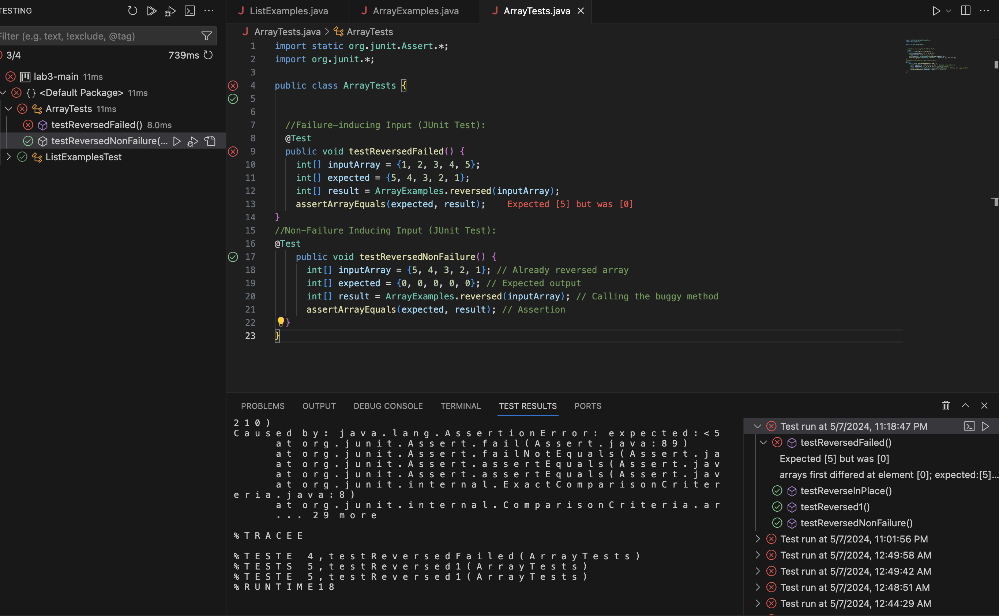

# lab-report3
**Failure Inducing Input**:
```

@Test
    public void testReversedNonFailure() {
      int[] inputArray = {5, 4, 3, 2, 1}; // Already reversed array
      int[] expected = {0, 0, 0, 0, 0}; // Expected output
      int[] result = ArrayExamples.reversed(inputArray); // Calling the buggy method
      assertArrayEquals(expected, result); // Assertion
  }
}
```


**Non failure inducing input**:
```
@Test
    public void testReversedNonFailure() {
      int[] inputArray = {5, 4, 3, 2, 1}; // Already reversed array
      int[] expected = {0, 0, 0, 0, 0}; // Expected output
      int[] result = ArrayExamples.reversed(inputArray); // Calling the buggy method
      assertArrayEquals(expected, result); // Assertion
  }
}
```

**Tests output**:

**Code before with bug**:
```

static int[] reversed(int[] arr) {
    int[] newArray = new int[arr.length];
    for(int i = 0; i < arr.length; i += 1) {
      arr[i] = newArray[arr.length - i - 1]; // Incorrect assignment
    }
    return arr;
  }
```
**Code after**
```

static int[] reversed(int[] arr) {
    int[] newArray = new int[arr.length];
    for (int i = 0; i < arr.length; i++) {
        newArray[i] = arr[arr.length - i - 1]; // Corrected assignment
    }
    return newArray;
}
```

The fix addresses the issue because now each element of the input array ``ar`` is assigned to the correct index. Now the new array ``newArray``  is in the correct reversed order. This code makes sure that the output array has the elements of the input array in reversed order but it doesn't change the input array itself.

**Grep** 
```

grep "error" ./technical/preface.txt
```
* This looks for the word "error" in the file preface.txt within the ./technical directory and displays all lines containing that word. It's useful for quickly identifying errors or specific patterns within a file.
```
grep -r "TODO" ./technical/
```
*This looks for the pattern "TODO" in all files within the ./technical directory and its subdirectories. This is helpful for finding instances of TODO comments or unfinished tasks within a project.

**find**
```
find ./technical/ -type f -mtime -7
```
* This looks for all the files within the ./technical directory that have been modified within the last 7 days. It's useful for locating recently edited files in a directory structure.
```
find ./technical/ -type d -name "images"
```
* This looks for directories named "images" within the ./technical directory. This can be handy when trying to locate specific directories within a complex file hierarchy.
**less**
```
less ./technical/readme.txt
```
* This looks at the readme.txt file within the ./technical directory in the less pager, allowing you to scroll through its contents. It's useful for viewing large files without overwhelming your terminal.
```
ls -l ./technical/ | less
```
* This looks at the 'ls -l' lists detailed information about files and directories within the ./technical directory, and the output is piped to less, allowing you to scroll through it. This is helpful when dealing with long directory listings.

Source used: ChatGPT (Prompts given: "for grep, find, and less, give 2 examples of using it on files and directories from ./technical. "
Output given: ``grp "TODO" -r "IN PROGRESS" task-list.txt`` , ``grep "error" ./technical/logfile.txt | sed 's/error/REPLACEMENT_STRING/g`` , ``find ./technical/ -type f -mtime -5`` , ``find ./technical/ -type d -name 'graphics'`` , `` less ./technical/chapter-1.txt `` , `` ls -l ./technical/ > output.txt
``


